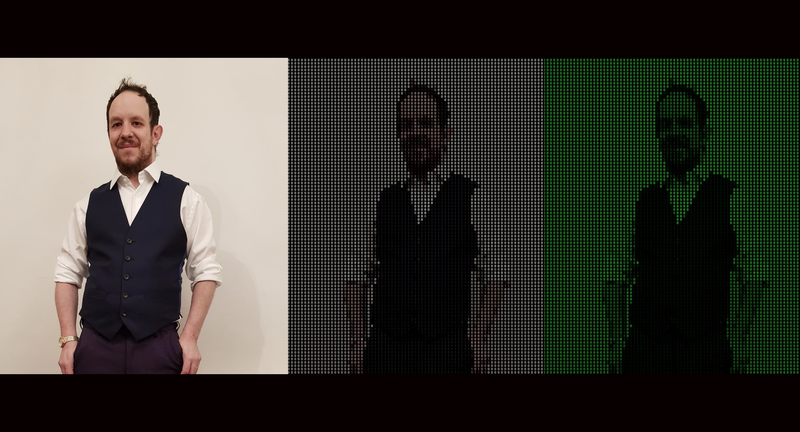

# Binary Image Converter

Original code from here: https://github.com/codegiovanni/Image_to_1_and_0  
Video Here: https://www.youtube.com/watch?v=AvUKUAQTww0  

This is just my adoption of Giovanni's code with a small fix to allow `rgba read in from img[i,j]` and show the image at the end.   
  
  

